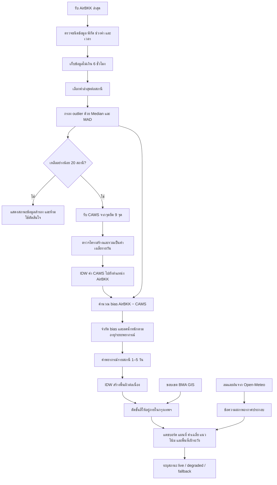

# หลักวิชาการและกระบวนงานจัดทำแผนที่พยากรณ์ PM2.5 กรุงเทพมหานครล่วงหน้า 1–5 วัน

> เอกสารประกอบรายงานการพัฒนาระบบ BKK Air Outlook  
> ขอบเขตเอกสาร: อธิบายระบบต้นแบบรุ่น 0.3 ตามวิธีที่ใช้งานจริง ณ เดือนสิงหาคม 2569  
> หน่วยความเข้มข้น PM2.5: ไมโครกรัมต่อลูกบาศก์เมตร (µg/m³)

## 1. บทสรุปสำหรับผู้อ่านทั่วไป

ระบบนี้จัดทำแผนที่แนวโน้ม PM2.5 ของกรุงเทพมหานครล่วงหน้า 1–5 วัน โดยผสมผสานข้อมูลสองประเภทที่มีข้อดีต่างกัน ได้แก่

1. **ค่าตรวจวัด AirBKK** บอกสภาพฝุ่นที่สถานีในกรุงเทพมหานครตรวจพบล่าสุด จึงสะท้อนสภาพพื้นที่จริงได้ดี แต่มีข้อมูลเฉพาะจุดที่ติดตั้งสถานี
2. **ค่าพยากรณ์ CAMS Global** บอกการเปลี่ยนแปลงของมลพิษในบรรยากาศล่วงหน้าอย่างต่อเนื่องทั้งพื้นที่ แต่เป็นแบบจำลองระดับโลกที่มีกริดค่อนข้างหยาบเมื่อเทียบกับขนาดเขตหรือถนนในกรุงเทพมหานคร

ระบบนำข้อดีของทั้งสองส่วนมารวมกัน โดยใช้ CAMS เป็น “โครงแนวโน้มในอนาคต” และใช้ AirBKK เป็น “ข้อมูลยึดโยงกับสภาพจริงล่าสุด” ก่อนประมาณค่าให้ต่อเนื่องทั่วกรุงเทพมหานคร ผลลัพธ์จึงควรอ่านเป็น **แนวโน้มเชิงพื้นที่ระดับเมือง** ไม่ใช่ค่าที่รับประกันว่าจะเกิดขึ้น ณ บ้าน ถนน หรือจุดใดจุดหนึ่งอย่างแม่นยำ

ระบบมีการคัดกรองข้อมูลก่อนคำนวณ เช่น ตัดข้อมูลเก่า เลือกค่าล่าสุดของแต่ละสถานี และกรองค่าที่โดดออกจากกลุ่มอย่างผิดปกติ หากแหล่งข้อมูลสำคัญไม่พร้อม ระบบจะแจ้งสถานะว่าใช้ข้อมูลสำรองหรือข้อมูลไม่ครบ แทนการทำให้ผู้ใช้เข้าใจว่าเป็นข้อมูลสด

## 2. วัตถุประสงค์และขอบเขตการใช้งาน

### 2.1 วัตถุประสงค์

- แสดงค่าเฉลี่ย PM2.5 ที่คาดหมายล่วงหน้ารายวัน 1–5 วัน
- แสดงความแตกต่างเชิงพื้นที่ภายในขอบเขตกรุงเทพมหานคร
- ช่วยระบุพื้นที่ที่ควรเฝ้าระวังและแนวโน้มการเพิ่มหรือลดของฝุ่น
- สื่อสารสถานะ ความสด ความครบถ้วน และข้อจำกัดของข้อมูล
- วางฐานสำหรับการประเมินความแม่นยำย้อนหลังและการพัฒนาแบบจำลองรุ่นต่อไป

### 2.2 สิ่งที่ระบบนี้ยังไม่ใช่

- ไม่ใช่ระบบประกาศเตือนภัยอย่างเป็นทางการ
- ไม่ใช่การพยากรณ์ระดับถนนหรือระดับอาคาร
- ไม่ใช่แบบจำลองการแพร่กระจายมลพิษความละเอียดสูงที่คำนวณแหล่งกำเนิด การจราจร และชั้นบรรยากาศโดยตรง
- ไม่ใช่ Kriging และยังไม่มี variogram ที่สอบเทียบจากข้อมูลย้อนหลัง
- คะแนนความเชื่อมั่นที่ติดมากับข้อมูลเป็นคะแนนเชิงกฎสำหรับการสื่อสาร มิใช่ความน่าจะเป็นทางสถิติที่ผ่าน calibration

## 3. กรอบแนวคิดทางวิชาการ

ความเข้มข้น PM2.5 ณ ตำแหน่งและเวลาใดเวลาหนึ่งเป็นผลร่วมของหลายกระบวนการ เช่น การปล่อยมลพิษ การก่อตัวของฝุ่นทุติยภูมิ การพัดพา การกระจายตัวในชั้นบรรยากาศ การตกสะสม และการชะล้างด้วยฝน ดังนั้นค่าตรวจวัดล่าสุดเพียงอย่างเดียวไม่สามารถบอกอนาคตได้ ขณะที่แบบจำลองระดับโลกเพียงอย่างเดียวอาจไม่สะท้อนลักษณะเฉพาะพื้นที่เมือง

แนวทางของระบบจึงเป็น **observation-informed model forecast** หรือการใช้ค่าตรวจวัดช่วยปรับพยากรณ์จากแบบจำลอง ประกอบด้วยหลักสำคัญ 4 ประการ:

1. **Quality control** — ใช้ข้อมูลที่สด อยู่ในขอบเขต และผ่านการตรวจค่าผิดปกติ
2. **Model–observation bias correction** — คำนวณส่วนต่างระหว่าง AirBKK กับ CAMS ณ เวลาปัจจุบัน แล้วนำไปปรับ CAMS ในอนาคต
3. **Temporal decay** — ลดอิทธิพลของค่าปรับเมื่อเวลาพยากรณ์ไกลออกไป เพราะสภาพปัจจุบันมีความเกี่ยวข้องกับอนาคตลดลง
4. **Spatial interpolation** — ใช้ค่าจากจุดที่ทราบประมาณค่าระหว่างจุด เพื่อสร้างพื้นผิวต่อเนื่องภายในขอบเขตกรุงเทพมหานคร

## 4. ข้อมูลที่ใช้

| ชุดข้อมูล | ตัวแปรที่ใช้ | บทบาทในระบบ | ความละเอียด/ข้อสังเกต |
|---|---|---|---|
| AirBKK | PM2.5, พิกัด, วันเวลา, รหัสสถานี, เขต, ชื่อพื้นที่, ประเภทสถานี | ค่าตรวจวัดล่าสุดและข้อมูลสำหรับปรับ bias | เป็นข้อมูลจุด คุณภาพและเวลารายงานอาจต่างกันระหว่างสถานี |
| CAMS Global ผ่าน Open-Meteo Air Quality API | PM2.5 ปัจจุบันและรายช่วงเวลา | แนวโน้มพยากรณ์พื้นฐาน 1–5 วัน | CAMS Global มีความละเอียดประมาณ 0.4° หรือราว 45 กม. และข้อมูล PM2.5 มีช่วงเวลาประมาณ 3 ชั่วโมง |
| Open-Meteo Weather Forecast | ความเร็วลมสูงสุด ทิศลมเด่น และโอกาสฝนสูงสุดรายวัน | ข้อมูลประกอบการสื่อสาร ไม่ได้เข้าในสมการ PM2.5 รุ่น 0.3 โดยตรง | ใช้พิกัดตัวแทนกลางกรุงเทพฯ จึงไม่แทนความต่างรายเขต |
| ขอบเขตเขต กทม. จาก BMA GIS | รูปหลายเหลี่ยมเขต | กำหนด mask ให้ชั้นสีแสดงเฉพาะกรุงเทพมหานคร | ใช้เพื่อการตัดขอบและแสดงผล ไม่ได้เพิ่มความแม่นยำของค่าพยากรณ์ |
| OpenStreetMap | แผนที่ฐาน | บริบทตำแหน่ง ถนน และสถานที่ | ต้องคงข้อความ attribution ตามเงื่อนไขการใช้งาน |

ระบบเรียก CAMS ที่จุดยึด 9 จุด ครอบคลุมพื้นที่กรุงเทพฯ และบริเวณรอบข้างในรูปตาราง 3 × 3 เพื่อให้มีสนามพยากรณ์พื้นฐานสำหรับการประมาณค่าเชิงพื้นที่

## 5. การควบคุมคุณภาพข้อมูล AirBKK

### 5.1 การตรวจรูปแบบและช่วงค่าพื้นฐาน

ระเบียนจะถูกยอมรับในขั้นแรกเมื่อ:

- ละติจูด ลองจิจูด ค่า PM2.5 และเวลา แปลงเป็นตัวเลขหรือเวลาได้
- ค่า PM2.5 อยู่ระหว่าง 0–500 µg/m³
- พิกัดอยู่ในกรอบครอบคลุมกรุงเทพฯ และพื้นที่ข้างเคียง: ละติจูด 13.45–14.10 และลองจิจูด 100.20–101.00

ช่วง 0–500 เป็น guardrail ทางระบบเพื่อกันค่าที่เป็นไปไม่ได้หรือเกิดจากรูปแบบข้อมูลผิด มิใช่เกณฑ์ตัดสินคุณภาพอากาศ

### 5.2 ความสดของข้อมูล

ใช้เฉพาะข้อมูลย้อนหลังไม่เกิน 6 ชั่วโมงจากเวลาที่ระบบประมวลผล และยอมให้เวลาจากต้นทางนำหน้าเวลาระบบได้ไม่เกิน 1 ชั่วโมงเพื่อรองรับความคลาดเคลื่อนของนาฬิกา หากข้อมูลใหม่ที่สุดมีอายุไม่เกิน 3 ชั่วโมงและข้อมูลอากาศประกอบพร้อม ระบบจึงแสดงสถานะ “ข้อมูลอัปเดตแล้ว” มิฉะนั้นแสดง “ข้อมูลอัปเดตบางส่วน”

### 5.3 การลบข้อมูลซ้ำ

หากสถานีเดียวกันมีหลายระเบียนในช่วงเวลา ระบบเก็บเฉพาะระเบียนที่ใหม่ที่สุด โดยใช้รหัสสถานีเป็นกุญแจหลัก และใช้คู่พิกัดแทนเมื่อไม่มีรหัสสถานี วิธีนี้ป้องกันไม่ให้สถานีที่ส่งข้อมูลถี่กว่ามีน้ำหนักมากกว่าสถานีอื่นโดยไม่ตั้งใจ

### 5.4 การกรองค่าผิดปกติด้วย Median Absolute Deviation

ใช้มัธยฐาน (median) เป็นค่าศูนย์กลาง เพราะทนต่อค่าที่สูงหรือต่ำผิดปกติได้ดีกว่าค่าเฉลี่ย จากนั้นคำนวณ Median Absolute Deviation (MAD):

$$
\operatorname{MAD}=\operatorname{median}\left(\left|x_i-\operatorname{median}(x)\right|\right)
$$

ในระบบรุ่น 0.3 ยอมรับสถานีเมื่อ:

$$
|x_i-\tilde{x}| \leq \max(35, 6\operatorname{MAD})
$$

โดย $x_i$ คือค่าของสถานี และ $\tilde{x}$ คือมัธยฐานของทุกสถานีหลังลบข้อมูลซ้ำ ค่า 35 µg/m³ และตัวคูณ 6 เป็น **กฎเชิงวิศวกรรมของระบบต้นแบบ** เพื่อหลีกเลี่ยงการตัดเหตุการณ์ฝุ่นสูงจริงมากเกินไป ไม่ใช่ค่ามาตรฐานสากล จึงควรสอบเทียบกับข้อมูลย้อนหลังในรุ่นถัดไป

ระบบต้องเหลือสถานีที่ผ่านการคัดกรองอย่างน้อย 20 สถานี มิฉะนั้นจะไม่สร้างผลพยากรณ์สดและเปลี่ยนไปใช้สถานะข้อมูลสำรอง

## 6. การเตรียมข้อมูล CAMS

1. รับค่าปัจจุบันและค่าพยากรณ์ PM2.5 จากจุดยึด 9 จุด
2. ตรวจว่าพิกัด อาร์เรย์เวลา และอาร์เรย์ PM2.5 มีรูปแบบถูกต้องและมีความยาวตรงกัน
3. จัดกลุ่มค่าตามวันที่ในเขตเวลา Asia/Bangkok
4. คำนวณค่าเฉลี่ยรายวันของแต่ละจุดยึด
5. ใช้ค่าเฉลี่ยรายวันเมื่อมีอย่างน้อย 6 **ช่วงเวลาแบบจำลอง** ในวันนั้น

ข้อควรระวัง: CAMS Global ที่เข้าถึงผ่าน API นี้มีความละเอียดเวลาประมาณ 3 ชั่วโมง ดังนั้นคำว่า “6 ช่วงเวลา” โดยทั่วไปหมายถึงข้อมูลประมาณ 18 ชั่วโมง ไม่ใช่ 6 ชั่วโมง เอกสารหรือส่วนแสดงผลในอนาคตควรใช้คำว่า “ช่วงเวลาแบบจำลอง” เพื่อไม่ให้สับสน

หากวันใดมีช่วงเวลาไม่ครบ ระบบต่อแนวโน้มจากวันก่อนหน้า โดยจำกัดการเปลี่ยนแปลงไว้ระหว่าง −3 ถึง +3 µg/m³ ต่อวัน และจำกัดผลลัพธ์ให้อยู่ในช่วง 0–500 µg/m³ ค่าวันดังกล่าวถูกระบุเป็น `extrapolated` และควรตีความด้วยความระมัดระวังมากกว่าวันที่ CAMS ครบ

## 7. การประมาณเชิงพื้นที่ด้วย Inverse Distance Weighting

### 7.1 สมการ IDW

ค่าที่ตำแหน่งเป้าหมาย $s_0$ ประมาณจากค่าที่จุดทราบ $s_i$ ดังนี้:

$$
\hat{Z}(s_0)=\frac{\sum_{i=1}^{n}w_i Z(s_i)}{\sum_{i=1}^{n}w_i}, \qquad
w_i=\frac{1}{d(s_0,s_i)^p}
$$

ระบบใช้ $p=2$ จึงให้น้ำหนักลดลงตามกำลังสองของระยะทาง จุดใกล้มีอิทธิพลมากกว่าจุดไกล ในการคำนวณจากละติจูด–ลองจิจูด มีการปรับระยะในแนวลองจิจูดด้วย $\cos(\text{latitude})$ เพื่อลดความบิดเบือนของพิกัดภูมิศาสตร์ในระดับพื้นที่กรุงเทพฯ

### 7.2 การใช้ IDW สองชั้น

**ชั้นที่ 1: จุดยึด CAMS → ตำแหน่งสถานี AirBKK**  
ประมาณค่าปัจจุบันและค่าพยากรณ์ CAMS ณ พิกัดของแต่ละสถานี เพื่อให้สามารถเทียบค่าตรวจวัดกับแบบจำลอง ณ ตำแหน่งเดียวกัน

**ชั้นที่ 2: ค่าพยากรณ์ที่สถานี → พื้นผิวแผนที่**  
หลังปรับ bias แล้ว ค่าพยากรณ์ของสถานีทั้งหมดถูกใช้สร้าง raster IDW ขนาดประมาณ 460 พิกเซลในแนวนอน จากนั้นใช้ polygon ขอบเขตกรุงเทพฯ เป็น mask และแสดงเป็นชั้นสีโปร่งแสงบนแผนที่

### 7.3 เหตุผลที่เลือก IDW ในระบบต้นแบบ

- อธิบายง่ายและตรวจสอบสมการได้
- ทำงานรวดเร็วพอสำหรับการสร้างแผนที่ในเว็บเบราว์เซอร์
- ไม่ต้องประมาณ variogram จากข้อมูลย้อนหลังจำนวนมาก
- ให้พื้นผิวต่อเนื่องและผ่านค่าที่จุดข้อมูล

### 7.4 ข้อจำกัดของ IDW

- สมมติว่าอิทธิพลขึ้นกับระยะทางเป็นหลัก แต่ PM2.5 ยังขึ้นกับลม แหล่งกำเนิด อาคาร และสภาพชั้นบรรยากาศ
- ไม่ให้ค่าความแปรปรวนหรือความไม่แน่นอนเชิงพื้นที่โดยธรรมชาติ
- อาจเกิดลักษณะวงแหวนรอบสถานีและทำให้ค่าราบเรียบเกินจริง
- พื้นที่ที่สถานีเบาบางอาจได้รับอิทธิพลจากจุดไกลมากเกินไป
- การเพิ่มความละเอียดของภาพ raster ไม่ได้เพิ่มความละเอียดแท้จริงของข้อมูลต้นทาง

## 8. การปรับค่าคลาดเคลื่อนของแบบจำลอง

สำหรับสถานี $j$ คำนวณ bias ณ เวลาปัจจุบันเป็น:

$$
b_j=\operatorname{clamp}\left(O_j-M_{j,0},-60,60\right)
$$

โดย $O_j$ คือ AirBKK ล่าสุด และ $M_{j,0}$ คือค่า CAMS ปัจจุบันที่ IDW มายังตำแหน่งสถานี การจำกัด bias ที่ ±60 µg/m³ ป้องกันไม่ให้สถานีเดียวหรือความต่างระดับความละเอียดระหว่างข้อมูลสองชุดทำให้พยากรณ์กระโดดมากเกินไป

พยากรณ์ที่สถานีสำหรับวันล่วงหน้า $k$ คือ:

$$
\hat{Y}_{j,k}=\operatorname{clamp}\left(M_{j,k}+b_j\exp\left[-\frac{24k+a_j}{48}\right],0,500\right)
$$

โดย:

- $M_{j,k}$ คือพยากรณ์ CAMS ที่ตำแหน่งสถานีในวันที่ $k$
- $a_j$ คืออายุข้อมูลสถานี หน่วยชั่วโมง
- 48 ชั่วโมงคือ time scale ของการลดน้ำหนักในรุ่นต้นแบบ

ผลของสมการคือ ค่าตรวจวัดที่ใหม่มีอิทธิพลมากกว่าค่าเก่า และ bias มีอิทธิพลมากในวันแรกก่อนลดลงตามระยะพยากรณ์ วิธีนี้ช่วยให้ระยะไกลกลับไปอาศัยแนวโน้มของแบบจำลองมากขึ้น

ทั้งขีดจำกัด ±60 และ time scale 48 ชั่วโมงเป็นพารามิเตอร์ต้นแบบ ต้องประเมินด้วย hindcast/cross-validation ก่อนนำไปใช้อ้างอิงเชิงนโยบาย

## 9. ความหมายของค่ารายวันและแผนที่

- ค่าที่แสดงในแต่ละวันเป็นค่าเฉลี่ยรายวันจากแบบจำลองที่ได้รับการปรับ bias ไม่ใช่ค่าสูงสุดรายชั่วโมง
- จุดสถานีบนแผนที่แสดงตำแหน่งอ้างอิงของ AirBKK แต่ตัวเลขวันล่วงหน้าเป็นค่าพยากรณ์ ไม่ใช่ค่าตรวจวัด
- ชั้นสีเป็นค่าประมาณระหว่างจุดด้วย IDW และถูกตัดให้แสดงภายในกรุงเทพฯ
- ค่าเฉลี่ย กทม. ในแถบสรุปเป็นค่าเฉลี่ยเลขคณิตของค่าพยากรณ์ ณ สถานีที่ผ่าน QC ไม่ใช่ค่าเฉลี่ยถ่วงพื้นที่หรือประชากร
- รายชื่อพื้นที่เฝ้าระวังคือสถานีที่มีค่าพยากรณ์สูงสุดในวันที่เลือก จึงไม่เท่ากับอันดับค่าเฉลี่ยรายเขตอย่างเป็นทางการ

## 10. คะแนนความเชื่อมั่นและความไม่แน่นอน

ระบบปัจจุบันกำหนดคะแนนฐานตามระยะพยากรณ์เป็น 80, 72, 64, 55 และ 40 สำหรับวันที่ 1–5 ตามลำดับ แล้วลดคะแนนเมื่อข้อมูลบางส่วนขาด คะแนนนี้สะท้อนหลักทั่วไปว่าความไม่แน่นอนเพิ่มตามระยะพยากรณ์ แต่ยังมีข้อจำกัดสำคัญ:

- ยังไม่ได้คำนวณจากการกระจายตัวของ ensemble
- ยังไม่ได้สอบเทียบให้คะแนน 80 หมายถึงเหตุการณ์ถูกต้องร้อยละ 80
- ค่าช่วงความไม่แน่นอนที่กำหนดไว้ยังเป็นค่าคงที่เชิงออกแบบ มิใช่ prediction interval จากความคลาดเคลื่อนย้อนหลัง

ดังนั้นในรายงานควรเรียกว่า **คะแนนความพร้อม/ความน่าเชื่อถือเชิงปฏิบัติการ** มากกว่า “ความน่าจะเป็นของความถูกต้อง” และไม่ควรใช้เป็นหลักฐานทางสถิติจนกว่าจะผ่านการประเมินย้อนหลัง

## 11. Workflow ของระบบ

### 11.1 ลำดับการทำงานเชิงระบบ

1. API ฝั่งเซิร์ฟเวอร์เรียก AirBKK, CAMS และข้อมูลอากาศพร้อมกัน
2. AirBKK และ CAMS เป็นแหล่งจำเป็น หากแหล่งใดล้ม ระบบเข้าสู่ fallback
3. ข้อมูลอากาศเป็นแหล่งประกอบ หากล้ม ระบบยังสร้างค่าฝุ่นได้ แต่ลดสถานะเป็น degraded
4. ระบบทำ QC และสร้างค่าพยากรณ์รายสถานี 5 วัน
5. API ส่งข้อมูลพร้อม metadata คุณภาพ เช่น จำนวนสถานีดิบ สถานีสด สถานีหลังลบซ้ำ จำนวน outlier อายุข้อมูล และ coverage ของ CAMS
6. เว็บรับข้อมูลพยากรณ์และขอบเขตเขต กทม. แยกกัน
7. เบราว์เซอร์สร้างพื้นผิว IDW ตัดด้วยขอบเขตกรุงเทพฯ และซ้อนบนแผนที่ฐาน
8. ผู้ใช้เลือกวัน เปิด/ปิดชั้นสี จุดสถานี และช่วงความไม่แน่นอนได้
9. ผล API ถูก cache ระยะสั้นเพื่อลดภาระต้นทาง แต่ยังคงรอบอัปเดตที่เหมาะกับข้อมูล

## 12. สถานะข้อมูลและการจัดการความล้มเหลว

| สถานะ | ความหมาย | แนวทางตีความ |
|---|---|---|
| `live` | AirBKK ล่าสุดไม่เกิน 3 ชั่วโมง ข้อมูลหลักและข้อมูลอากาศพร้อม | ใช้ดูแนวโน้มได้ โดยยังต้องคำนึงถึงข้อจำกัดของแบบจำลอง |
| `degraded` | ข้อมูลหลักสร้างพยากรณ์ได้ แต่ AirBKK เก่ากว่า 3 ชั่วโมงหรือข้อมูลอากาศประกอบขาด | ใช้ด้วยความระมัดระวังและติดตามรอบถัดไป |
| `fallback` | AirBKK/CAMS ใช้งานไม่ได้ ข้อมูลผ่าน QC น้อยกว่าเกณฑ์ หรือเกิดข้อผิดพลาดสำคัญ | เป็นข้อมูลสำรองสำหรับรักษาหน้าจอ ไม่ควรใช้ตัดสินใจ |

ระบบ cache ผลสำเร็จที่เบราว์เซอร์ 5 นาทีและ shared cache 15 นาที พร้อมอนุญาตใช้ผลเดิมระหว่างอัปเดตได้สูงสุด 1 ชั่วโมง ส่วน fallback กำหนด `no-store` เพื่อไม่ให้ข้อมูลสำรองค้างใน cache

## 13. การตรวจสอบความถูกต้องที่ควรดำเนินการ

การที่ระบบทำงานได้และข้อมูลผ่าน QC ไม่ได้แปลว่าพยากรณ์แม่นยำ การรับรองคุณภาพต้องใช้การประเมินย้อนหลังอย่างเป็นระบบ

### 13.1 การทำ hindcast

เก็บ snapshot ของพยากรณ์ทุกครั้งพร้อม `issuedAt`, model run, ค่า input และพารามิเตอร์ จากนั้นเมื่อถึงวันจริงให้นำ AirBKK ที่ผ่าน QC มาเป็นข้อมูลตรวจสอบ ห้ามใช้ข้อมูลอนาคตย้อนกลับไปปรับพยากรณ์เดิม เพราะจะเกิด data leakage

### 13.2 การแบ่งชุดข้อมูล

- แบ่งตามเวลา เช่น train/calibration period และ test period ที่อยู่ภายหลังจริง
- ใช้ rolling-origin evaluation เพื่อเลียนแบบการทำงานประจำวัน
- ประเมินแยกฤดูฝุ่น ฤดูฝน วันทำงาน วันหยุด และเหตุการณ์ค่าฝุ่นสูง
- ทำ spatial leave-one-station-out เพื่อตรวจวัดความสามารถในการประมาณพื้นที่ที่ไม่มีสถานี

### 13.3 ตัวชี้วัดที่แนะนำ

| มิติ | ตัวชี้วัด | คำอธิบาย |
|---|---|---|
| ความคลาดเคลื่อน | MAE | ขนาดความคลาดเคลื่อนเฉลี่ย อ่านง่ายและทนต่อค่ารุนแรงกว่า RMSE |
| ความคลาดเคลื่อนรุนแรง | RMSE | ให้น้ำหนักกับข้อผิดพลาดขนาดใหญ่มากขึ้น |
| อคติ | Mean Bias Error | ตรวจว่าระบบทำนายสูงหรือต่ำกว่าจริงเป็นระบบหรือไม่ |
| ความสัมพันธ์ | Pearson/Spearman correlation | ตรวจว่าระบบติดตามการขึ้นลงได้ดีเพียงใด แต่ไม่แทนความถูกต้องเชิงขนาด |
| การจำแนกระดับ | Accuracy, precision, recall, F1 | ประเมินการทำนายระดับคุณภาพอากาศ โดยให้ความสำคัญกับ recall ของวันเสี่ยง |
| ความไม่แน่นอน | Prediction interval coverage และ width | ใช้เมื่อระบบพัฒนาช่วงพยากรณ์ที่มาจากข้อมูลจริงแล้ว |

ควรรายงานตัวชี้วัดแยกตาม lead time 1–5 วันและแยกตามสถานี/เขต เพราะค่าเฉลี่ยรวมอาจซ่อนพื้นที่ที่ระบบทำได้ไม่ดี

### 13.4 แบบจำลองฐานที่ต้องเปรียบเทียบ

- Persistence: ใช้ค่าล่าสุดเป็นค่าของทุกวัน
- Climatology: ใช้ค่าเฉลี่ยตามเดือนหรือฤดูกาล
- CAMS ดิบที่ไม่ปรับ bias
- CAMS + bias correction รุ่นปัจจุบัน
- วิธี interpolation ทางเลือก เช่น ordinary kriging เมื่อมีข้อมูลเพียงพอ

แบบจำลองใหม่ควรนำมาใช้เมื่อดีกว่า baseline อย่างสม่ำเสมอบนชุดทดสอบที่ไม่เคยใช้ปรับพารามิเตอร์

## 14. IDW กับ Kriging

| ประเด็น | IDW ที่ใช้อยู่ | Ordinary Kriging |
|---|---|---|
| หลักการ | ถ่วงน้ำหนักด้วยระยะทาง | ใช้โครงสร้าง spatial autocorrelation ผ่าน variogram |
| การตั้งค่า | เลือก power และจุดข้างเคียง | ต้องประมาณ nugget, sill, range และแบบจำลอง variogram |
| ความไม่แน่นอน | ไม่มีโดยธรรมชาติ | ให้ kriging variance ภายใต้สมมติฐานของแบบจำลอง |
| ปริมาณข้อมูล | ใช้ได้ง่ายกับข้อมูลไม่มาก | ต้องมีข้อมูลเชิงพื้นที่/ย้อนหลังเพียงพอเพื่อประมาณ variogram ที่เสถียร |
| ความเร็ว | สูง เหมาะกับเว็บ | สูงขึ้นตามจำนวนจุดและการ fit แบบจำลอง |
| ความเหมาะสมปัจจุบัน | เหมาะกับ baseline ที่โปร่งใส | เหมาะเป็นรุ่นทดลองถัดไปหลังมีคลังข้อมูลย้อนหลังและ cross-validation |

Kriging ไม่ได้แม่นกว่า IDW โดยอัตโนมัติ หาก variogram ไม่เสถียรหรือโครงสร้างฝุ่นไม่ stationary ผลอาจแย่ลง จึงต้องเปรียบเทียบด้วย spatial cross-validation และใช้ covariates เช่น ลม การใช้ที่ดิน ถนน หรือข้อมูลการปล่อย หากพัฒนาไปสู่ universal kriging/regression kriging

## 15. ข้อจำกัดสำคัญของระบบรุ่น 0.3

1. CAMS Global มีกริดหยาบกว่าขนาดเขตกรุงเทพฯ มาก จุดยึด 9 จุดไม่ได้สร้างข้อมูลรายละเอียดใหม่
2. AirBKK ถูกใช้ทั้งเป็นจุดปรับ bias และจุดสร้างพื้นผิว หากประเมินบนสถานีเดิมโดยไม่แยกข้อมูล อาจให้ผลดีเกินจริง
3. การกรอง outlier ระดับเมืองอาจตัด hotspot จริงเฉพาะพื้นที่ จึงต้องตรวจร่วมกับ metadata สถานีและสถานีข้างเคียง
4. ระบบยังไม่ใช้ความสูงชั้นผสม ความชื้น อุณหภูมิ ปริมาณฝนจริง การจราจร จุดความร้อน หรือบัญชีการปล่อยมลพิษในสมการ PM2.5
5. ข้อมูลลมและฝนในรุ่นนี้เป็นเพียงข้อความประกอบ ไม่ได้เปลี่ยนค่าพยากรณ์ PM2.5
6. ค่าเฉลี่ยรายสถานีให้น้ำหนักแต่ละสถานีเท่ากัน จึงไม่ใช่ค่าเฉลี่ยเชิงพื้นที่หรือ exposure ของประชากร
7. IDW ไม่คำนึงถึงทิศลม สิ่งกีดขวาง และความไม่ต่อเนื่องของพื้นที่
8. ค่าคงที่ของ QC, bias cap, temporal decay และคะแนนความเชื่อมั่นยังต้องสอบเทียบ
9. ชุด fallback เป็นข้อมูลสาธิตที่ฝังมากับระบบ มิใช่ค่าปัจจุบัน
10. ระบบยังไม่ควรใช้เพื่อออกคำเตือนด้านสุขภาพหรือการปฏิบัติการโดยไม่มีการทวนสอบจากหน่วยงานผู้รับผิดชอบ

## 16. แนวทางพัฒนาต่อ

### ระยะเร่งด่วน

- เก็บพยากรณ์และค่าจริงทุกวันเพื่อสร้างฐาน hindcast
- เปลี่ยนคำว่า coverage “ชั่วโมง” เป็น “ช่วงเวลาแบบจำลอง” ให้ตรงกับข้อมูล CAMS
- แสดง metadata คุณภาพที่สำคัญในหน้าสำหรับผู้ดูแล
- สอบเทียบเกณฑ์ freshness, MAD, bias cap และ decay ด้วยข้อมูลย้อนหลัง
- แยก fallback ออกจากผลสดอย่างเห็นได้ชัดและไม่ใช้ค่า fallback ในรายงานผลการประเมิน

### ระยะกลาง

- เพิ่ม prediction interval จาก residual distribution หรือ ensemble
- เปรียบเทียบ IDW, kriging, regression kriging และ machine-learning downscaling
- ใช้ลม ฝน ความชื้น boundary-layer height การจราจร การใช้ที่ดิน และแหล่งกำเนิดเป็น covariates
- สร้างค่าเฉลี่ยถ่วงพื้นที่และถ่วงประชากรแยกจากค่าเฉลี่ยสถานี
- ทำ dashboard ผลประเมิน MAE/RMSE/bias แยก lead time และสถานี

### ระยะยาว

- พัฒนา operational model พร้อม model registry, versioning, monitoring และ automatic rollback
- ตรวจ concept drift และการเปลี่ยนแปลงชนิด/ตำแหน่งสถานี
- จัดทำ uncertainty communication ที่เชื่อมโยงกับผล calibration
- ให้ผู้เชี่ยวชาญด้านคุณภาพอากาศ สถิติ และสาธารณสุขทบทวนก่อนใช้เชิงนโยบาย

## 17. หลักความโปร่งใสและการสื่อสารความเสี่ยง

- แยกคำว่า “ตรวจวัด” ออกจาก “พยากรณ์” ทุกครั้ง
- แสดงวันเวลาและเขตเวลาของข้อมูล
- ระบุแหล่งข้อมูล รุ่นแบบจำลอง และสถานะข้อมูล
- ไม่ใช้คำว่า “แม่นยำ” หากไม่มีผลทดสอบย้อนหลังรองรับ
- ไม่ตีความพื้นผิวสีละเอียดเกินกว่าความละเอียดของแหล่งข้อมูล
- เปิดเผยว่าคะแนนความเชื่อมั่นเป็น heuristic จนกว่าจะผ่าน calibration
- เก็บ audit trail ของ input, output, model version และ error สำหรับการตรวจสอบย้อนหลัง
- เมื่อข้อมูลไม่พร้อม ควรแสดง “ไม่มีข้อมูลที่เชื่อถือได้” แทนการเติมค่าที่ดูเหมือนข้อมูลจริง

## 18. ตัวอย่างข้อความสำหรับใส่ในรายงาน

### 18.1 ฉบับย่อ

> ระบบพยากรณ์ PM2.5 กรุงเทพมหานครล่วงหน้า 1–5 วันใช้ค่าตรวจวัดล่าสุดจาก AirBKK ร่วมกับพยากรณ์องค์ประกอบบรรยากาศ CAMS Global โดยผ่านการตรวจความสด การลบข้อมูลซ้ำ และการกรองค่าผิดปกติด้วยสถิติที่ทนต่อ outlier จากนั้นปรับค่าคลาดเคลื่อนของ CAMS ด้วยข้อมูลสถานี โดยลดน้ำหนักของค่าปรับตามอายุข้อมูลและระยะพยากรณ์ ค่ารายสถานีถูกประมาณเป็นพื้นผิวต่อเนื่องด้วยวิธี Inverse Distance Weighting และตัดตามขอบเขตกรุงเทพมหานคร ผลลัพธ์มีวัตถุประสงค์เพื่อแสดงแนวโน้มระดับเมือง มิใช่ค่ารับรองระดับถนนหรือประกาศเตือนภัยอย่างเป็นทางการ

### 18.2 ฉบับเชิงวิชาการ

> แบบจำลองต้นแบบเป็น observation-informed deterministic forecast ซึ่งใช้ CAMS Global เป็น background field และใช้ AirBKK เป็นข้อมูลสำหรับ local bias correction ค่าพยากรณ์ CAMS ถูก interpolate มายังตำแหน่งสถานีด้วย IDW power 2 ก่อนคำนวณ residual ระหว่างค่าตรวจวัดกับแบบจำลอง residual ถูกจำกัดช่วงและถ่วงด้วย exponential temporal decay เพื่อสร้างค่าพยากรณ์รายสถานี 1–5 วัน จากนั้นจึงใช้ IDW อีกชั้นเพื่อสร้างพื้นผิวแสดงผลภายใน polygon กรุงเทพมหานคร การควบคุมคุณภาพประกอบด้วย range/geographic checks, six-hour freshness window, station-level deduplication และ robust MAD filter ทั้งนี้พารามิเตอร์ QC และ bias correction ยังเป็นค่าต้นแบบที่ต้องสอบเทียบด้วย rolling-origin และ spatial cross-validation ก่อนใช้เชิงนโยบาย

## 19. เอกสารอ้างอิงและแหล่งข้อมูล

1. Copernicus Atmosphere Monitoring Service. **CAMS global atmospheric composition forecasts**. อธิบายการผสานแบบจำลองกับข้อมูลดาวเทียม การพยากรณ์วันละสองรอบ และช่วงพยากรณ์ 5 วัน: <https://www.copernicus.eu/en/access-data/copernicus-services-catalogue/cams-global-atmospheric-composition-forecasts>
2. Open-Meteo. **Air Quality API Documentation**. ระบุพารามิเตอร์ API, CAMS Global, ความละเอียดประมาณ 0.4° (~45 กม.), temporal resolution 3 ชั่วโมง และการพยากรณ์ 5 วัน: <https://open-meteo.com/en/docs/air-quality-api>
3. Copernicus Atmosphere Monitoring Service. **Production systems**. อธิบาย atmospheric model, satellite data assimilation, analyses, forecasts และ reanalysis: <https://atmosphere.copernicus.eu/production-systems>
4. Shepard, D. (1968). **A two-dimensional interpolation function for irregularly-spaced data**. Proceedings of the 23rd ACM National Conference, 517–524. DOI: <https://doi.org/10.1145/800186.810616>
5. Leys, C., Ley, C., Klein, O., Bernard, P., & Licata, L. (2013). **Detecting outliers: Do not use standard deviation around the mean, use absolute deviation around the median**. Journal of Experimental Social Psychology, 49(4), 764–766. DOI: <https://doi.org/10.1016/j.jesp.2013.03.013>
6. World Health Organization. (2021). **WHO global air quality guidelines: particulate matter (PM2.5 and PM10), ozone, nitrogen dioxide, sulfur dioxide and carbon monoxide**: <https://iris.who.int/handle/10665/345329>
7. OpenStreetMap contributors. **Copyright and License**: <https://www.openstreetmap.org/copyright>

## 20. การควบคุมรุ่นเอกสาร

| รายการ | ค่า |
|---|---|
| ระบบที่อธิบาย | BKK Air Outlook – PM2.5 forecast baseline 0.3 |
| ระยะพยากรณ์ | 1–5 วัน |
| วิธีประมาณเชิงพื้นที่ | IDW, power 2 |
| วิธีปรับแบบจำลอง | Local additive bias correction with exponential temporal decay |
| วิธี QC หลัก | Freshness, deduplication, range/geographic checks, robust MAD filter |
| สถานะการรับรอง | ระบบต้นแบบ ยังไม่ผ่านการรับรองเพื่อออกคำเตือน |

เมื่อมีการเปลี่ยนแหล่งข้อมูล สมการ พารามิเตอร์ เกณฑ์ QC หรือวิธีแสดงผล ควรเพิ่มหมายเลขรุ่นและบันทึกการเปลี่ยนแปลง เพื่อให้ผลย้อนหลังสามารถทำซ้ำและเปรียบเทียบได้อย่างถูกต้อง
